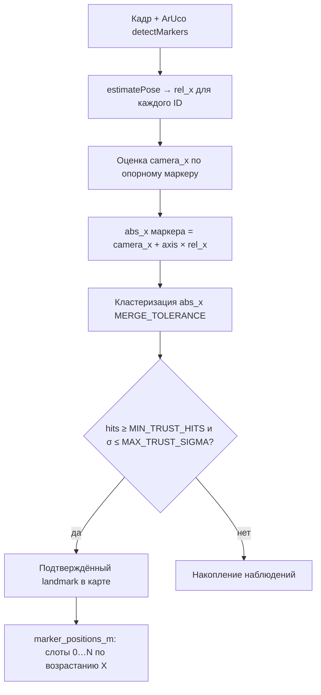

# XY-калибровка: spatial landmark map

## Цель

Построить карту **положений маркеров вдоль пути крана** (метры по оси X), не полагаясь на порядок ArUco ID. Физически маркеры могут иметь ID `0, 1, 2, 4, 5, 3` — система сопоставляет их **по координате**, а не по «ID = слот».

## Входные настройки (UI `/xy-settings`)

| Параметр | Смысл |
|----------|--------|
| `marker_size_mm` | Сторона маркера для PnP |
| `reference_marker_id` | ArUco ID **опорного** маркера (нулевая точка пути) |
| `zero_marker_offset_m` | Смещение нуля в метрах |
| `movement_direction` | `left_to_right; axis=normal` или `axis=reversed` |

## Алгоритм калибровки



### Формула camera X (опорный маркер)

```
camera_x = zero_marker_offset_m − axis_sign × rel_x_m
```

`axis_sign = +1` при `axis=normal`, `−1` при `axis=reversed`.

### Система доверия

Наблюдения одной физической точки сливаются в **кластер** (`MERGE_TOLERANCE_M`). Landmark подтверждается, если:

- `hits ≥ CRAN_MIN_TRUST_HITS` (по умолчанию 7)
- разброс σ ≤ `CRAN_MAX_TRUST_SIGMA_M` (по умолчанию 8 см)
- новая точка не ближе `CRAN_MIN_LANDMARK_SEPARATION_M` к уже подтверждённой

### Выход в JSON

`marker_positions_m` — слоты `"0"…"N"`, отсортированные по X (не ArUco ID):

```json
"marker_positions_m": {
  "0": 0.0,
  "1": 0.0618,
  "2": 0.1011
}
```

Дополнительно сохраняются `landmark_trust`, `reference_marker_id`, `roi`, intrinsics.

## Процедура для оператора

1. `/xy-settings` — задать размер маркера и **ID опорного** ArUco.
2. `/xy-calib-1920x1080` — запустить поток, «Начать калибровку».
3. Медленно провести тележку вдоль всего пути, чтобы каждый маркер многократно попал в кадр.
4. «Завершить калибровку» → `/calibration-complete` → сохранить в JSON.

## Связь с runtime

Runtime (`bridge_pose_estimator`) использует **ту же** `SpatialMarkerMap` и те же формулы match, что и калибровка. После изменения карты или `reference_marker_id` **перекалибруйте XY**.

См. [bridge-pose-runtime.md](bridge-pose-runtime.md).
